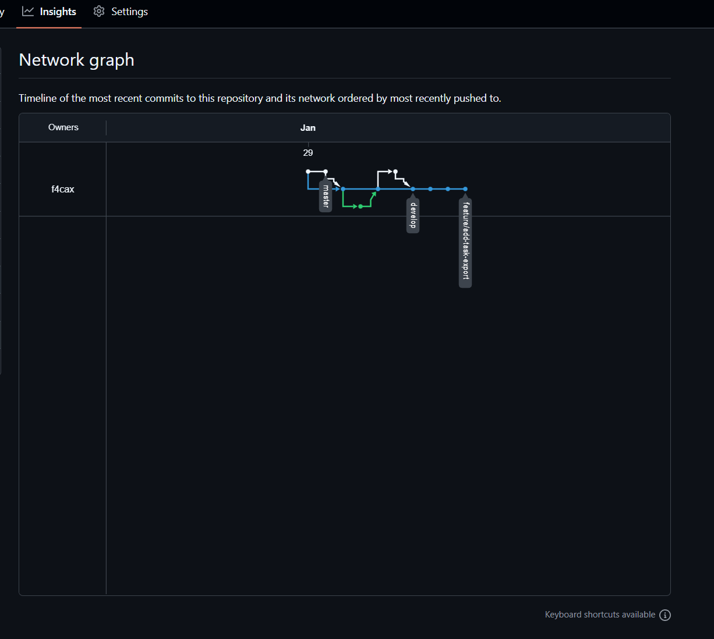

# Task Manager

## What does it do?

Task Manager is a simple command-line application for managing your daily tasks. It allows you to:

- Add new tasks
- List all tasks
- Mark tasks as completed
- Remove tasks from the list

The application provides an intuitive interface for organizing your work and personal tasks efficiently.

## Developer

This project is developed as part of the DevSecOps course assignment to demonstrate Git Flow workflow and GitHub best practices.

**Developer:** Student Name  
**Course:** DevSecOps  
**Institution:** [Your Institution]

## Links

- [Installation Guide](install.md)
- [Changelog](CHANGELOG.md)
- [Git Commands Cheat Sheet](git-commands.md)

## Network Branching Diagram

## Getting Started

See [install.md](install.md) for detailed installation instructions.

## Version

Current version: **1.0.0**

## License

This project is created for educational purposes.

